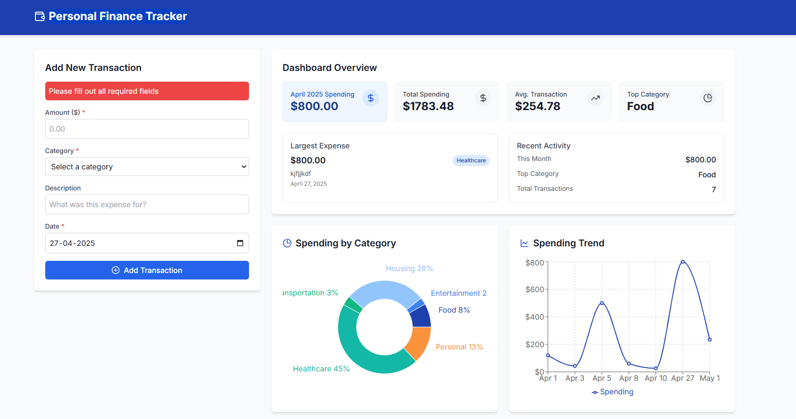

# 📊 Personal Finance Tracker

[](https://reactjs.org/)
[](https://vitejs.dev/)
[](#license)

Welcome to **Personal Finance Tracker** — a simple React application to help users **track expenses**, **analyze spending habits**, and **visualize financial trends** easily.

---

## ✨ Features

- **Add new transactions** with amount, category, description, and date
- **Dashboard** showing:
  - Total monthly spending
  - Pie chart breakdown by category
  - Line chart showing spending over time
- **Filter transactions** by date range or category
- **Data persistence** using localStorage (your data won't disappear on refresh)
- **Responsive design** for desktop and mobile
- **Fast performance** using **Vite** as the build tool

---

## 🛠️ Tech Stack

- **React** (Frontend UI)
- **Vite** (Development server and build tool)
- **Chart.js** or **Recharts** (for graphs and charts)
- **Custom React Hooks** (for clean state management)

---

### Explanation:

1. **Run Instructions**:
   - **Clone** the repository.
   - **Install dependencies** with `npm install`.
   - **Start the development server** using `npm run dev`.
   - **Build** for production with `npm run build`.
   - **Deploy** the app to GitHub Pages with `npm run deploy`.

---

### Demo


<video controls src="Personal Finance Tracker - Google Chrome 2025-04-27 22-53-08.mp4" title="Title"></video>

---

<!-- ```   -->

Made with ❤️ by **Vinay Kumar Reddy Mangalampenta**.

<!-- ``` -->
